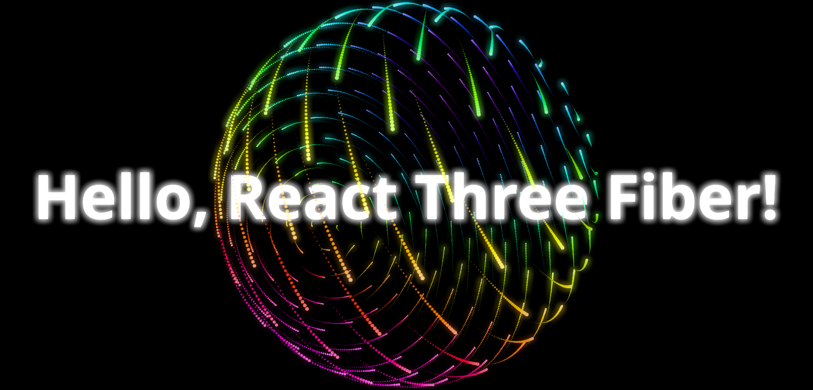

# 🌐 **My First React Three Fiber Project**



Welcome to my first **React Three Fiber** project! This repository showcases a 3D visualization using React and Three.js through the powerful React Three Fiber library.

---

## 🚀 **Live Demo**

Check out the live version here: [**Live Demo**](YOUR_LIVE_DEMO_LINK)

---

## 📦 **Getting Started**

Follow these steps to run the project on your local machine.

### 1. **Clone the Repository**

```bash
git clone https://github.com/YOUR_USERNAME/YOUR_REPO.git
cd YOUR_REPO
```
### 2. **Install Dependencies**

```bash
npm install
```
### 3. **Run The Development Server**

```bash
npm run dev
```
### 3. **Open The Project**

After running the development server, you can view your project by opening the following link in your browser:

```bash
http://localhost:5173
```


